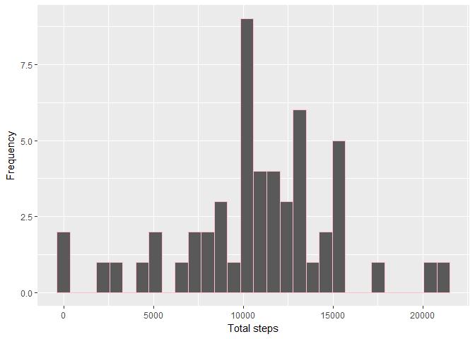
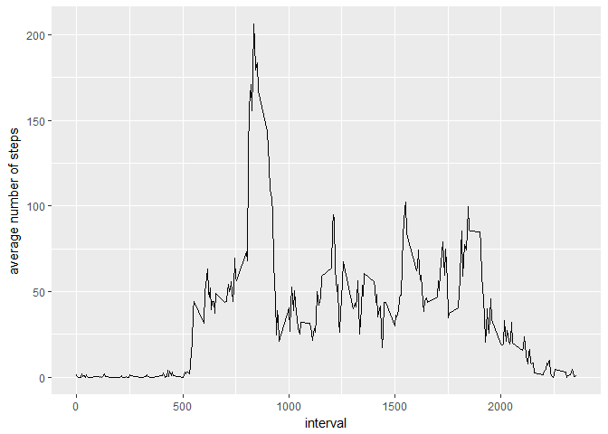
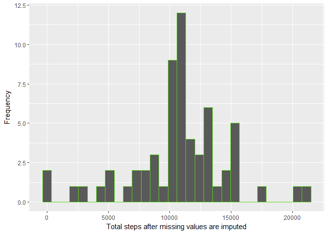
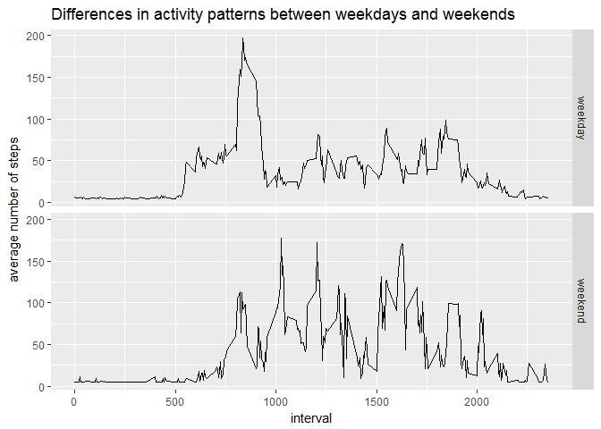

# Reproducible Research: Peer Assessment 1
Tak Au  
April 17, 2017  


This assignment makes use of data from a personal activity monitoring device. This device collects data at 5 minute intervals through out the day. The data consists of two months of data from an anonymous individual collected during the months of October and November, 2012 and include the number of steps taken in 5 minute intervals each day.

Dataset: [Activity monitoring data](https://d396qusza40orc.cloudfront.net/repdata%2Fdata%2Factivity.zip) [52K]

The variables included in this dataset are:

>
* steps: Number of steps taking in a 5-minute interval (missing values are coded as NA)
* date: The date on which the measurement was taken in YYYY-MM-DD format
* interval: Identifier for the 5-minute interval in which measurement was taken

The dataset is stored in a comma-separated-value (CSV) file and there are a total of 17,568 observations in this dataset.


setwd("C:/Users/...")

initiate R packages

```r
library(data.table)
library(ggplot2)
```

## Loading and preprocessing the data

```r
dt_activity <- fread("activity.csv")
```
## What is mean total number of steps taken per day?

```r
sumSteps <- dt_activity[, .(sum(steps)), keyby = date]
```
#### plot total number of steps taken per day

```r
ggplot(sumSteps, aes(V1)) + 
        geom_histogram(colour = "pink") + 
        xlab("Total steps") +
        ylab("Frequency")
```

<!-- -->

#### Calculate and report the mean and median of the total number of steps taken per day

```r
meanSteps <- sumSteps[, mean(V1, na.rm = TRUE)]
meanSteps
```

```
## [1] 10766.19
```

```r
medianSteps <- sumSteps[, median(V1, na.rm = TRUE)]
medianSteps
```

```
## [1] 10765
```
## What is the average daily activity pattern?

```r
dt_interval <- dt_activity[, mean(steps, na.rm = TRUE), keyby = interval]
```
#### Time series plot of the average number of steps taken

```r
ggplot(dt_interval, aes(interval, V1)) +
        geom_line() +
        ylab("average number of steps")
```

<!-- -->

#### Calculate the 5-minute interval that, on average, contains the maximum number of steps
between 08.35 and 08.40 am

```r
dt_interval[which.max(dt_interval$V1)]
```

```
##    interval       V1
## 1:      835 206.1698
```
## Imputing missing values
There are 2304 NA's which will be replaced with the overall average steps/interval, that is 37.38

```r
summary(dt_activity)
```

```
##      steps            date              interval     
##  Min.   :  0.00   Length:17568       Min.   :   0.0  
##  1st Qu.:  0.00   Class :character   1st Qu.: 588.8  
##  Median :  0.00   Mode  :character   Median :1177.5  
##  Mean   : 37.38                      Mean   :1177.5  
##  3rd Qu.: 12.00                      3rd Qu.:1766.2  
##  Max.   :806.00                      Max.   :2355.0  
##  NA's   :2304
```
imput missing value

```r
dt_ReplaceNA <- dt_activity[, lapply(.SD, function(x){ifelse(is.na(x), 37.38, x)})]
summary(dt_ReplaceNA)
```

```
##      steps            date              interval     
##  Min.   :  0.00   Length:17568       Min.   :   0.0  
##  1st Qu.:  0.00   Class :character   1st Qu.: 588.8  
##  Median :  0.00   Mode  :character   Median :1177.5  
##  Mean   : 37.38                      Mean   :1177.5  
##  3rd Qu.: 37.38                      3rd Qu.:1766.2  
##  Max.   :806.00                      Max.   :2355.0
```
#### Calculate the total number of steps taken each day after missing values are imputed

```r
sumStepsFill <- dt_ReplaceNA[, sum(steps), keyby = date]
```
#### Histogram of the total number of steps taken each day after missing values are imputed. 

```r
ggplot(sumStepsFill, aes(V1)) + 
        geom_histogram(colour = "#56d81a") + 
        xlab("Total steps after missing values are imputed") + 
        ylab("Frequency")
```

<!-- -->
Calculation and the histogram show there is only slight differ in value of steps taken per day after missing value are imputed, however the frequency of the maximum steps/interval has increased.

```r
sumStepsFill[, mean(V1)]
```

```
## [1] 10766.09
```

```r
sumStepsFill[, median(V1)]
```

```
## [1] 10765.44
```
## Are there differences in activity patterns between weekdays and weekends?

#### Create a new factor variable in the dataset with two levels - "weekday" and "weekend" indicating whether a given date is a weekday or weekend day.

```r
dt_ReplaceNA$date <- as.Date(dt_ReplaceNA$date)
dt_ReplaceNA[, WD := ifelse(weekdays(date) %in% c("Staurday", "Sunday"), "weekend", "weekday")]
```

```
##        steps       date interval      WD
##     1: 37.38 2012-10-01        0 weekday
##     2: 37.38 2012-10-01        5 weekday
##     3: 37.38 2012-10-01       10 weekday
##     4: 37.38 2012-10-01       15 weekday
##     5: 37.38 2012-10-01       20 weekday
##    ---                                  
## 17564: 37.38 2012-11-30     2335 weekday
## 17565: 37.38 2012-11-30     2340 weekday
## 17566: 37.38 2012-11-30     2345 weekday
## 17567: 37.38 2012-11-30     2350 weekday
## 17568: 37.38 2012-11-30     2355 weekday
```

```r
dt_ReplaceNA$WD <- as.factor(dt_ReplaceNA$WD)
str(dt_ReplaceNA)
```

```
## Classes 'data.table' and 'data.frame':	17568 obs. of  4 variables:
##  $ steps   : num  37.4 37.4 37.4 37.4 37.4 ...
##  $ date    : Date, format: "2012-10-01" "2012-10-01" ...
##  $ interval: int  0 5 10 15 20 25 30 35 40 45 ...
##  $ WD      : Factor w/ 2 levels "weekday","weekend": 1 1 1 1 1 1 1 1 1 1 ...
##  - attr(*, ".internal.selfref")=<externalptr>
```


```r
weekSteps <- dt_ReplaceNA[, mean(steps), keyby = c("WD", "interval")]
```

#### Panel plot containing a time series plot of the 5-minute interval and the average number of steps taken, averaged across all weekday days or weekend days.

```r
qplot(interval, V1, data = weekSteps, 
      geom = "line", 
      ylab = "average number of steps",
      main = "Differences in activity patterns between weekdays and weekends",
      facets = WD~.)
```

<!-- -->
